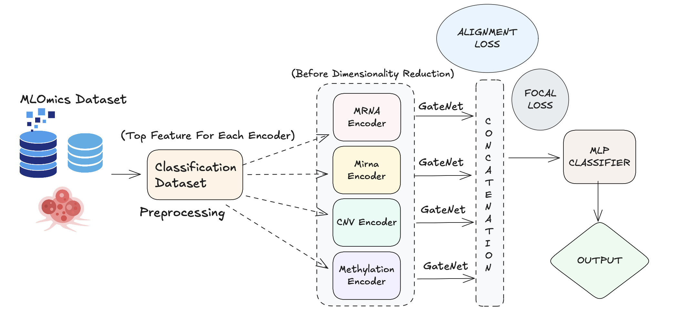
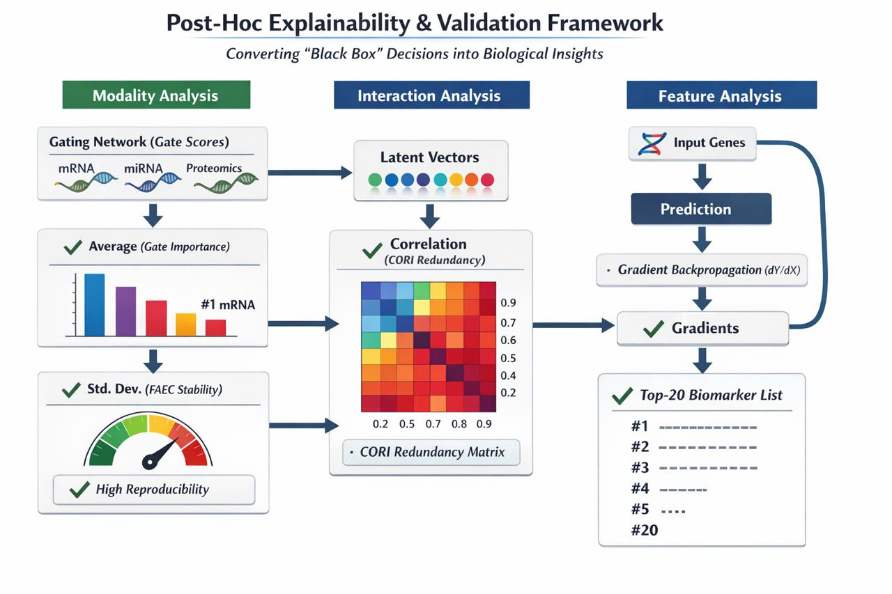

# Gated Multi-Omics Fusion for Pan-Cancer Subtyping

This repository contains a multi-omics deep learning pipeline for pan-cancer subtype prediction using gated fusion across `mRNA`, `miRNA`, `CNV`, and `DNA methylation` features. The training workflow performs stratified cross-validation, modality-aware feature fusion, classifier-head ablation, gradient-based sensitivity analysis, and automated export of publication-ready plots and CSV summaries.



## Overview

The core model learns a latent representation for each omics modality and then applies a context-aware gate to each latent block before final classification. This lets the network dynamically emphasize the most informative modality for each sample instead of relying on static concatenation alone.

The current `src` pipeline supports:

- Multi-cancer training across `GS-BRCA`, `GS-LGG`, `GS-OV`, `GS-COAD`, and `GS-GBM`
- Gated multi-omics neural fusion with focal loss and regularization terms
- Dynamic fold selection based on the minimum class count
- Classifier-head ablation with `Base_MLP`, `SVM`, `XGBoost`, and `Deeper_MLP`
- Aggregated gate-importance plots and Top-20 feature sensitivity plots
- Fold-wise and global CSV export for downstream analysis



## Repository Layout

```text
ipd_code/
├── preprocessing/
│   └── processed_multicancer/
│       └── GS-*/                      # Per-cancer processed arrays and feature-name files
├── results_aggregated/               # Generated outputs after training
├── src/
│   ├── config.py                     # Global settings, paths, runtime configuration
│   ├── data.py                       # Dataset and feature-name loading
│   ├── models.py                     # Losses and gated fusion network
│   ├── training.py                   # Fold training and classifier ablation
│   ├── reporting.py                  # Plotting and CSV export
│   └── main.py                       # End-to-end training entrypoint
├── docs/
│   └── assets/                       # README figures
└── requirements.txt
```

## Data Format

Each cancer directory under `preprocessing/processed_multicancer/` is expected to contain:

- `mRNA_processed.npy`
- `miRNA_processed.npy`
- `CNV_processed.npy`
- `Methy_processed.npy`
- `labels.npy`
- `mRNA_features.json`
- `miRNA_features.json`
- `CNV_features.json`
- `Methy_features.json`

Example:

```text
preprocessing/processed_multicancer/GS-BRCA/
├── mRNA_processed.npy
├── miRNA_processed.npy
├── CNV_processed.npy
├── Methy_processed.npy
├── labels.npy
├── mRNA_features.json
├── miRNA_features.json
├── CNV_features.json
└── Methy_features.json
```

## Environment Setup

### 1. Create and activate a virtual environment

```bash
python3 -m venv .venv
source .venv/bin/activate
```

### 2. Install dependencies

```bash
pip install -r requirements.txt
```

The training pipeline expects these main packages:

- `torch`
- `numpy`
- `pandas`
- `matplotlib`
- `seaborn`
- `scikit-learn`
- `xgboost`
- `captum`

## How To Train

Run the full multi-cancer pipeline from the repository root:

```bash
python -m src.main
```

This command will:

1. Load each cancer dataset from `preprocessing/processed_multicancer/`
2. Train the gated fusion model with stratified cross-validation
3. Evaluate alternative classifier heads on the learned fused representation
4. Compute sensitivity-based Top-20 feature rankings for each omics modality
5. Save all aggregated figures and CSV summaries to `results_aggregated/`

## Outputs

After training, the pipeline writes outputs such as:

- `results_aggregated/final_ablation_summary_all_cancers.csv`
- `results_aggregated/<CANCER>/detailed_ablation_results.csv`
- `results_aggregated/<CANCER>/aggregated_gate_importance.png`
- `results_aggregated/<CANCER>/aggregated_top20_mRNA.csv`
- `results_aggregated/<CANCER>/aggregated_top20_mRNA.png`

Equivalent Top-20 feature files are also produced for `miRNA`, `CNV`, and `Methy`.

## Configuration

Main runtime settings are defined in `src/config.py`, including:

- `MAX_EPOCHS`
- `MIN_EPOCHS`
- `PATIENCE`
- `LR`
- `WEIGHT_DECAY`
- `ALIGN_W`
- `ORTHO_W`
- `GATE_ENT_W`
- `SPARSITY_W`
- `OMICS_DROPOUT_P`
- `LATENT_DIM`

If you want to adapt the pipeline for new experiments, this is the first file to modify.

## Method Summary

The model trains one encoder per modality, concatenates latent vectors to build global context, and then predicts modality-specific gates from that context. The gated latent vectors are fused and passed into a classifier head. Training combines focal loss with alignment, orthogonality, gate-entropy, and sparsity terms to improve robustness and reduce redundant modality usage.

The ablation workflow reuses learned fused embeddings and compares:

- Neural baseline head
- SVM head
- XGBoost head
- Deeper MLP head

This design makes it easier to test whether performance gains come from the representation itself, the classifier head, or both.

## Reproducibility

- Random seeds are fixed in `src/config.py`
- Fold generation uses `StratifiedKFold`
- CUDA is used automatically when available
- Output directories are created automatically on startup

## Troubleshooting

If `python -m src.main` fails, the most common causes are:

- Missing dependencies: run `pip install -r requirements.txt`
- Missing processed `.npy` files: verify the expected folder layout under `preprocessing/processed_multicancer/`
- Missing feature-name JSON files: the pipeline can fall back to generated feature names, but data arrays must still exist
- Environment mismatch: confirm the active interpreter is the same one where dependencies were installed

## Intended Use

This codebase is structured for research experimentation, internal benchmarking, and figure generation around multi-omics cancer subtype classification. For production or clinical deployment, additional dataset validation, calibration, uncertainty estimation, and external evaluation would be required.
