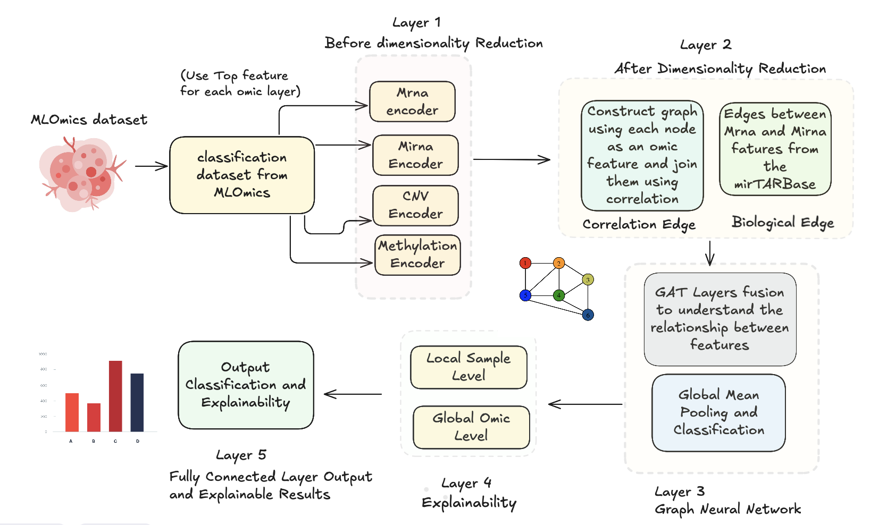

# Explainable GAT-MultiOmic Fusion

- This repository presents a multi-omics fusion architecture designed to improve cancer subtype classification and deliver interpretable relationships between omic features.
- We focus on:
  - Improving classification performance
  - Providing explainability at both sample-level and omic-level
  -  Modeling interactions between omic features through graph neural networks
  - Better handling high-dimensional omics data using encoder-based reduction
 
## Dataset
We evaluate our method on the [MLOmics](https://github.com/chenzRG/Cancer-Multi-Omics-Benchmark/tree/main?tab=readme-ov-file) benchmark dataset, which is curated from TCGA and provides classification-ready multi-omics data.

The dataset includes the following omics layers:
- mRNA
- miRNA
- Copy Number Variation (CNV)
- DNA Methylation

  
This dataset enables benchmarking multi-omics models for subtype cancer classification.

